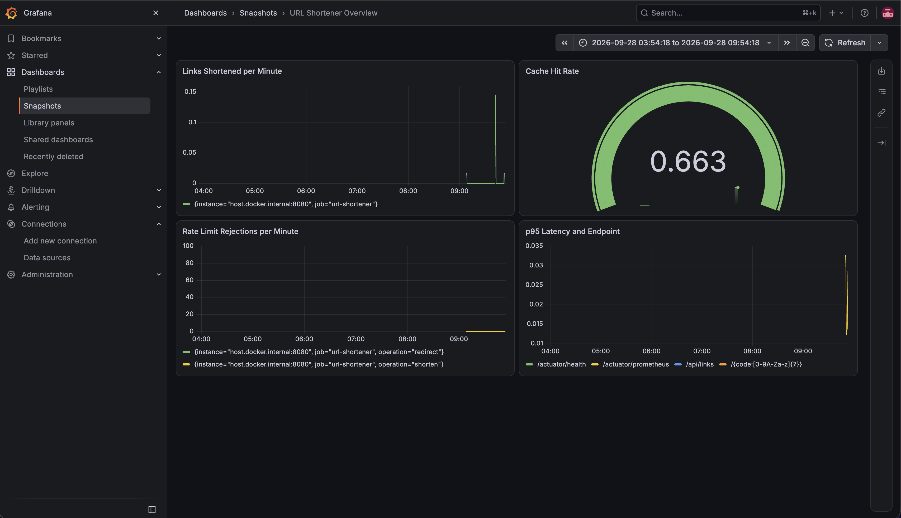

# URL Shortener

A URL shortener built with Java and Spring Boot, backed by PostgreSQL and Redis. It generates short, unguessable
codes for long URLs, redirects visitors to the original address, counts clicks, protects itself with a Redis-backed
rate limiter, and exposes metrics for a Prometheus + Grafana dashboard.

This is a portfolio project, run as a local demo — see [Limitations](#limitations) below.

## Stack

- **Java 25** / **Spring Boot 4.1.1**
- **PostgreSQL 18** — source of truth for every short link
- **Redis 8** — cache for redirects, click counters, and the rate limiter's token buckets
- **Flyway** — database migrations
- **Prometheus + Grafana** — metrics and dashboards
- **k6** — load testing
- **Testcontainers** — integration tests against real PostgreSQL and Redis, no mocks

## Running it locally

Requires Docker and a JDK 25.

```bash
docker compose up -d
./mvnw spring-boot:run
```

This starts PostgreSQL (`localhost:5433`), Redis (`localhost:6379`), Prometheus (`localhost:9090`), and Grafana
(`localhost:3000`, login `admin`/`admin`), then runs the application on `localhost:8080`.

### Try it

```bash
curl -X POST http://localhost:8080/api/links \
  -H "Content-Type: application/json" \
  -d '{"url":"https://example.com/some/long/path"}'
```

Returns something like:
```json
{"code":"aB3xK9z","shortUrl":"http://localhost:8080/aB3xK9z","targetUrl":"https://example.com/some/long/path","createdAt":"2026-09-28T12:00:00Z"}
```

Visiting `http://localhost:8080/aB3xK9z` redirects to the original URL.

### Running the tests

```bash
./mvnw test
```

All integration tests spin up real PostgreSQL and Redis containers via Testcontainers — no mocked infrastructure.

## API

| Method | Path                | Description                                  |
|--------|---------------------|-----------------------------------------------|
| POST   | `/api/links`        | Shorten a URL                                 |
| GET    | `/api/links/{code}` | Get metadata for a short link                 |
| GET    | `/{code}`           | Redirect to the target URL (302, counts a click) |

## Technical decisions

**Random codes, not sequential.** Codes are 7 random Base62 characters (`0-9A-Za-z`), giving about 3.5 trillion
possibilities. A sequential ID would be enumerable — anyone could guess `/000001`, `/000002`, and learn how many
links exist. A random code with a database uniqueness check (and a unique constraint as the real guarantee)
avoids that at a negligible collision cost.

**302, not 301, for the redirect.** A 301 (permanent redirect) gets cached by the browser, which stops sending the
request to the server on later visits — the click counter would only ever see the first visit. 302 (temporary)
keeps every visit going through the server.

**Cache-aside with two separate Redis keys.** The target URL (`link:{code}`) has a 1-hour TTL; the click counter
(`clicks:{code}`) has none, because losing a TTL'd counter would silently under-report clicks. Different data,
different lifetimes, different keys.

**Rate limiting with a token bucket, implemented as a Redis Lua script.** A naive "N requests per minute" counter
has a boundary problem: a client can send N requests at 00:59 and another N at 01:00, doubling the effective rate
for a moment. A token bucket (refills gradually, allows bursts up to a capacity) avoids that. The read-check-write
sequence needs to be atomic under concurrent requests from the same client, which is why it runs as a single Redis
`EVAL` instead of separate Java-side Redis calls — a Lua script runs to completion on the Redis server without
interleaving with another client's script.

**An injectable `Clock` instead of `Instant.now()`.** Every place that needs "now" (link creation timestamps, the
rate limiter) takes a `java.time.Clock` bean instead of calling `Instant.now()` directly, so tests can control time
without real `Thread.sleep()` calls. This was not a theoretical concern: an end-to-end rate limit test
(`RateLimitFlowTest`) originally used the real system clock and passed reliably on a fast local machine, but failed
intermittently in CI, where a slower runner let just enough real time pass during the test for the token bucket to
refill by one token, changing an expected `429` into a `302`. Switching that test to a fixed `Clock` made the test's
outcome independent of how fast the machine executing it happens to be.

## Limitations

This is a local demo, not a production deployment:
- No authentication — the API is open, as long as you can reach `localhost:8080`.
- No HTTPS — left to whoever deploys it.
- Rate limiting is keyed by the request's remote address. Behind a reverse proxy or load balancer, every request
  would appear to come from the proxy's IP unless `X-Forwarded-For` is read and trusted, which this project
  deliberately does not implement, to keep the scope focused on the rate limiting logic itself rather than proxy
  trust configuration.

## Load test results

Measured with [k6](https://k6.io) (scripts in [`k6/`](k6/)), against the application running locally with
PostgreSQL and Redis in Docker.

### Steady load (`k6/steady-load.js`)

1 shorten-and-redirect cycle per second for 30 seconds — matching the rate limiter's sustained refill rate, i.e.
what the system is designed to handle indefinitely without ever rejecting a request.

| Metric                  | Result       |
|--------------------------|--------------|
| Requests                | 60 (30 shortens + 30 redirects) |
| Failed requests          | 0% |
| p90 latency              | 16.08ms |
| p95 latency              | 17.36ms |
| Checks passed            | 100% (60/60) |

Zero errors and low double-digit millisecond latency under sustained, realistic use.

### Burst (`k6/burst-test.js`)

30 shorten requests fired at once, against a bucket with a capacity of 10 — deliberately exceeding the rate limit
to confirm it holds under pressure.

| Metric                  | Result       |
|--------------------------|--------------|
| Accepted (`201`)         | 10 |
| Rejected (`429`)         | 20 |
| Checks passed            | 100% (each response was expected to be either 201 or 429) |

The 66.66% "failed requests" k6 reports for this run is expected, not a defect: k6 counts any non-2xx/3xx response
as failed by default, but here the `429` responses are the rate limiter correctly doing its job. The numbers land
exactly on the configured bucket capacity of 10.

## Observability

Business metrics are exposed via Micrometer at `/actuator/prometheus` and scraped by Prometheus every 5 seconds:

- `links_shortened_total` — links created
- `link_cache_access_total{result="hit"|"miss"}` — Redis cache effectiveness for redirects
- `ratelimit_rejected_total{operation="shorten"|"redirect"}` — requests rejected by the rate limiter

Plus the request duration histograms (`http_server_requests_seconds_bucket`) that Spring Boot Actuator exposes
automatically, used for the p95 latency panel below.



## CI

Every push and pull request against `main` runs the full test suite (including the Testcontainers-based integration
tests) via GitHub Actions — see [`.github/workflows/ci.yml`](.github/workflows/ci.yml).
